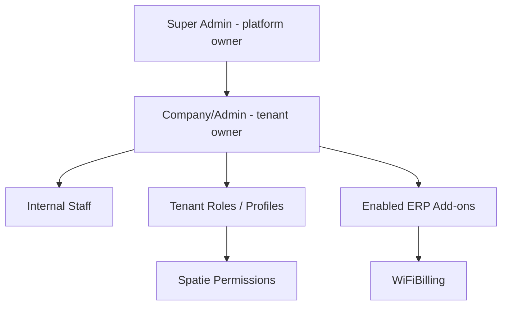
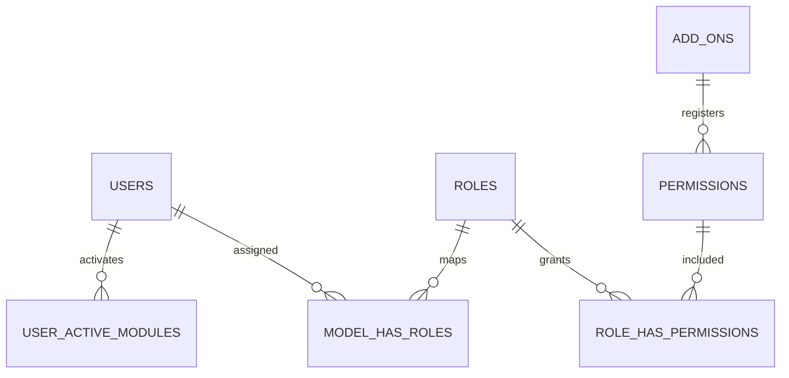
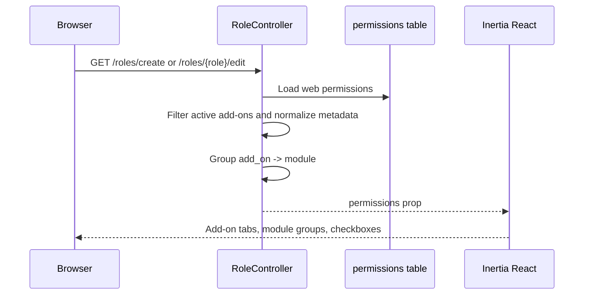
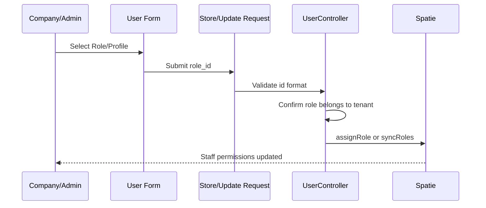

# StudyRoom Connect ERP - Roles, Permissions, Add-ons, and Staff Assignment Guide

## Purpose

This document explains the implemented Laravel/Inertia role and internal staff assignment flow for the ERP SaaS project. It covers project structure, model relationships, views, controllers, reusable add-on permission loading, WiFiBilling permission visibility, menu protection, route protection, and staff role/profile assignment.

WiFi Billing is one add-on in the ERP platform. The permission loader is reusable for future add-ons.

## Root Cause Fixed

The WiFiBilling permission rows existed in the database, but the role pages could hide them because the package module key is `WifiBilling` while the permission rows use `WiFiBilling`. A strict `Module_is_active($addOn)` filter could reject those rows even though the add-on was valid for the tenant.

The old flow also depended on `Auth::user()->getAllPermissions()`, so the role page could miss assignable add-on permissions when the current admin did not directly hold every row.

The fix:

1. Load assignable `web` permissions from Spatie permissions.
2. Normalize missing `add_on`, `module`, and `label` values.
3. Check normal module activation first.
4. Fall back to a case-insensitive activated-module comparison for add-on keys.
5. Group the final payload as `add_on -> module -> permissions`.
6. Use the same loader for role create and edit.

## Actor Model



## Project Structure

```text
app/
  Http/
    Controllers/
      RoleController.php
      UserController.php
      InternetPackageController.php
      CustomerController.php
      MikrotikRouterController.php
      ProvisioningController.php
    Requests/
      StoreUserRequest.php
      UpdateUserRequest.php
  Models/
    User.php
database/
  seeders/
    DatabaseSeeder.php
    StaffRoleSeeder.php
resources/
  js/
    pages/
      roles/
        create.tsx
        edit.tsx
        types.ts
      users/
        create.tsx
        edit.tsx
        types.ts
    utils/
      menu.ts
packages/
  studyroomtechlab/
    WifiBilling/
      src/
        Http/Controllers/DashboardController.php
        Resources/js/menus/company-menu.ts
routes/
  web.php
```

## Model Relationships



Important fields:

| Table | Field | Purpose |
| --- | --- | --- |
| `permissions` | `name` | Submitted permission slug, for example `view-mikrotik-routers` |
| `permissions` | `guard_name` | Must be `web` for the role UI |
| `permissions` | `label` | Human display label |
| `permissions` | `add_on` | Add-on group, for example `WiFiBilling` |
| `permissions` | `module` | Feature group, for example `mikrotik-routers` |
| `roles` | `created_by` | Tenant owner for staff assignable roles |
| `users` | `created_by` | Tenant owner for internal staff users |

## Controller Flow



`RoleController` now sends permissions shaped like this:

```php
[
    'WiFiBilling' => [
        'mikrotik-routers' => [
            [
                'id' => 1,
                'name' => 'view-mikrotik-routers',
                'label' => 'View MikroTik Routers',
                'module' => 'mikrotik-routers',
                'add_on' => 'WiFiBilling',
                'guard_name' => 'web',
            ],
        ],
    ],
]
```

## Role Views

Files:

- `resources/js/pages/roles/create.tsx`
- `resources/js/pages/roles/edit.tsx`
- `resources/js/pages/roles/types.ts`

Implemented behavior:

1. Permission search checks add-on, module, permission name, and permission label.
2. Select All applies to all visible permissions.
3. Add-on select/clear applies to the selected add-on tab.
4. Module select/clear applies to one module group.
5. `permission.name` is submitted to Laravel.
6. `permission.label` is displayed to the user.
7. Create and edit use the same grouped backend payload.

## Staff Assignment Flow

Internal staff are normal tenant users with Spatie roles. There is no second role system.



UI wording:

> Select a role/profile for this staff member. Permissions can be managed from Roles.

Backend behavior:

1. `UserController@index` loads tenant assignable roles and each user's current role.
2. `UserController@store` accepts `role_id`, with legacy `type` fallback.
3. `UserController@store` blocks Super Admin roles and roles outside the tenant.
4. `UserController@store` calls `$user->assignRole($role)`.
5. `UserController@update` validates and tenant-checks `role_id`.
6. `UserController@update` calls `$user->syncRoles([$role])`.

## Seeded Staff Profiles

`StaffRoleSeeder` and `User::ensureDefaultStaffProfiles()` seed these tenant roles safely with `updateOrCreate`:

- Admin
- Support Agent
- Billing Officer
- Sales / CRM
- Network Technician
- Installer
- Marketing
- Inventory Manager
- Viewer

The seeder is safe to rerun because it scopes by `name`, `guard_name`, and `created_by`.

## Menu And Route Protection

Menu filtering now removes parent menus that have no visible children. WiFiBilling menu items include child permissions such as:

- `view-wifi-dashboard`
- `view-internet-packages`
- `view-isp-customers`
- `view-mikrotik-routers`

Controllers enforce route access in addition to UI hiding:

- `InternetPackageController`
- `CustomerController`
- `MikrotikRouterController`
- `ProvisioningController`
- `packages/studyroomtechlab/WifiBilling/src/Http/Controllers/DashboardController.php`

Provisioning controller checks use the existing database permission names:

- `view-provisioning-logs`
- `create-provisioning-token`
- `deactivate-provisioning-token`
- `manage-provisioning`

The public token route stays public:

```php
Route::get('/provision/{token}', [ProvisioningController::class, 'show'])->name('provision.show');
```

## Cache And Verification Commands

```powershell
C:\xampp\php\php.exe artisan optimize:clear
C:\xampp\php\php.exe artisan config:clear
C:\xampp\php\php.exe artisan permission:cache-reset
C:\xampp\php\php.exe artisan route:list
```

If `permission:cache-reset` is unavailable, continue after clearing Laravel cache and report it.

## Verification Checklist

1. `/roles/create` shows `WiFiBilling`.
2. `/roles/edit` shows the same `WiFiBilling` modules.
3. Modules include `wifi-dashboard`, `internet-packages`, `isp-customers`, `mikrotik-routers`, `provisioning`, and `vouchers`.
4. Role create/edit search finds add-on, module, label, and permission name.
5. Select All works globally, per add-on, and per module.
6. User create/edit shows Role/Profile.
7. Staff role selection excludes Super Admin.
8. Staff assignment uses Spatie `assignRole()` and `syncRoles()`.
9. Menus hide unauthorized WiFiBilling entries.
10. Protected routes return 403 for unauthorized staff.
11. Super Admin routes are not broken.
12. `/provision/{token}` still works.
